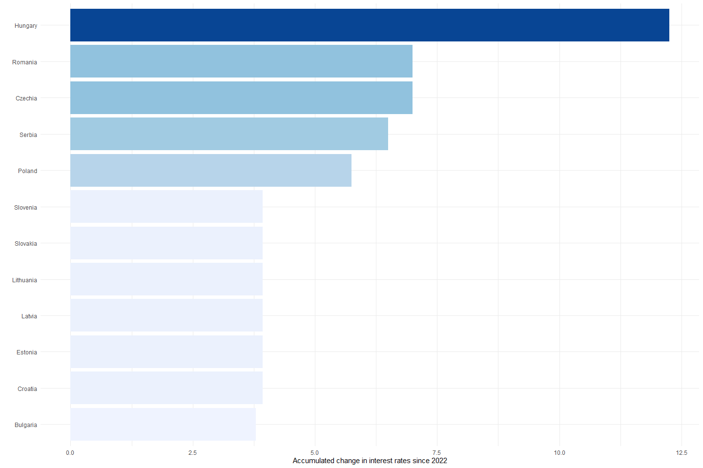
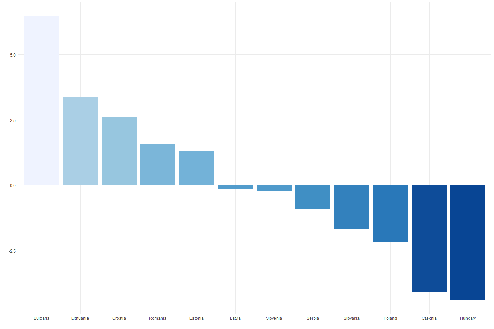

Descriptives, Tech Summary and Preliminary Estimates
================

# Descriptives

## Inflation peak

Inflation rates peaked around late 2022, early 2023. In all countries of
the sample, the spike in energy prices was several times larger compared
to the headline inflation rate, especially in the Baltic states, with
energy inflation in Estonia reaching over 120% year-on-year. The core
inflation rates at the time were more moderate, around half of the
headline inflation.

## Economic activity

The rebound after the covid shock is apparent across all of our
countries both from GDP growth and estimated output gap data. The GDP
growth data shows the “excess demand” generated by covid relief measures
as well as accumulated savings, however, in all countries economic
activity started to cool off prior to the breakout of the war, and
growth has been declining steadily since. The estimated output gaps are
near zero, however that is potentially a fault of the estimation (HP
filter end-point problem).

## Interest rate hikes

The graph below shows the accumulated change in interest rates from
January of 2022 to the end of our sample (as of now, 2023 November). Out
of all countries in the region, the Central Bank of Hungary has been
raising rates the most aggressively - unsurprisingly as a response to
the largest inflation rate observed in the region.

## Exchange rates

The graph below shows the change in REER and NEER indicators of the CEE
countries since 2022 (January 2022 = 100%). Appreciation in real terms
over the long run can be observed in all countries, as well as short
term nominal depreciation in most. Members of the European Monetary
Union have been more resilient to external shocks, as such countries
faced more moderate depreciation in their nominal exchange rates.
Hungary seemed to have been the most vulnerable to the war shock, with
the largest nominal depreciation, as well as a short run real
depreciation.

## Real wages

The graph below shows the change in real wage rates from the beginning
of 2022 (2022 January = 100%) as of the end of our sample (2023 Q2).
Labor markets show mixed outcomes, as almost half of our sample has
accumulated moderate growth in real wages, while 7 out of 12 countries
faced minimal to more severe welfare loss in the form of real wage
decline.

# Preliminary estimates and tech summary

## Decomposing the headline inflation rate

I run a Fixed Effects OLS regression across our country panel to
determine the contribution of core, food, and energy inflation rates to
the headline harmonized CPI inflation (all data are from Eurostat).

$CPI_{i,t} = \beta_{1}CORE_{i,t} + \beta_{2}FOOD_{i,t} + \beta_{3}ENERGY_{i,t}+ \delta_{i} + \gamma_{t} + \epsilon_{i,t}$

where $\delta_{i}$ are country fixed effects, $\gamma_{t}$ are annual
fixed effects and $\beta_{j}$ reference the weight of each component in
the headline inflation rate.

Below are the results for the last four years of the sample (2019-2023):

Same plot with fixed “Y” axis:

Potential follow-up:

Mediation analysis (/ an instrumental variable approach) could show if
there is any inter-play among the rates. It is not too unreasonable to
believe that government measures, such as price caps were instead
realized in growth of non-targeted goods. For example, price caps on
food or fuel items - resulting in revenue losses - were recouped by
firms via increasing the prices of items found in the core CPI basket.
This could be done by regressing each component on the other components
and accounting for the indirect effects.

## Real rates, equilibrium and policy stance

Here I first calculate real interest rates as
$r_{t} = i_{t} - \pi_{t+1}$, where $r_{t}$ is the real rate, $i_{t}$ is
the nominal rate and $\pi_{t}$ is the annualized CPI inflation rate. The
graph below shows the real rates across the countries in the sample:

To separate the natural rate from cyclical fluctuations, I use two
variations of the HP filter, a One-sided, and a Two-sided version. The
two approaches yield similar trends, with the one sided (naturally)
showing more fluctuations. The trend component estimated with the
filters can be considered as the equilibrium real interes rate, these
can be seen in the graph below:  The graphs here
show a historically declining equilibrium rate up to 2019/2020, where we
can observe a reversion in this trend.

The deviations from the trend, i.e. the cyclical components thus can be
used to asses policy stance:
<!-- -->
All graphs here agree that policy stance was following a very loose
monetary policy around 2-8 percent below the equilibrium, at the time
the war shock hit the economies. The graphs also show the fast response
of the regional central banks, as the real rate gaps rose sharply in the
following months.
